# P2---Database-Mariadb-Demo

## intro

brief side project learning about Mariadb, installing it as it would be in a working environment VM2 being the server and VM1 being the client  

## Setting up MariaDB
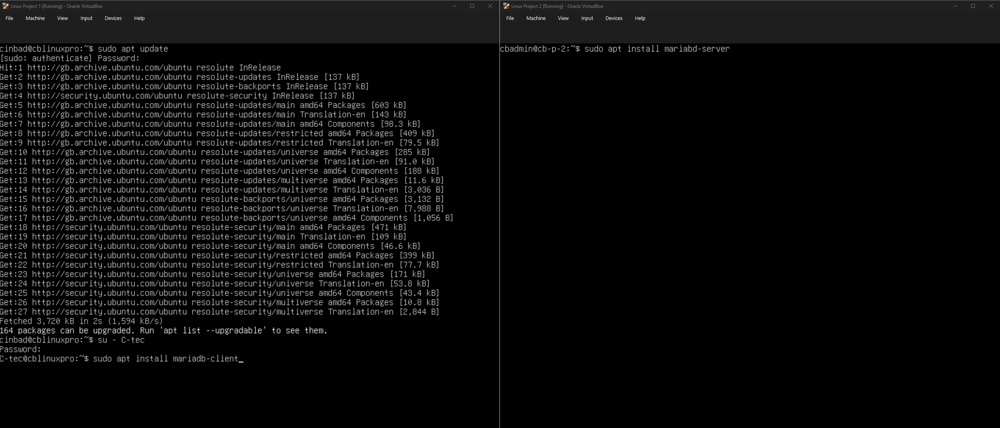
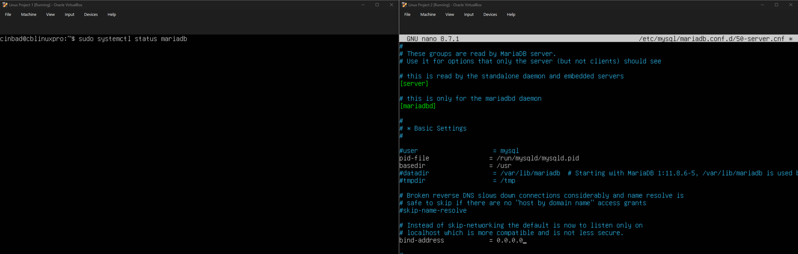
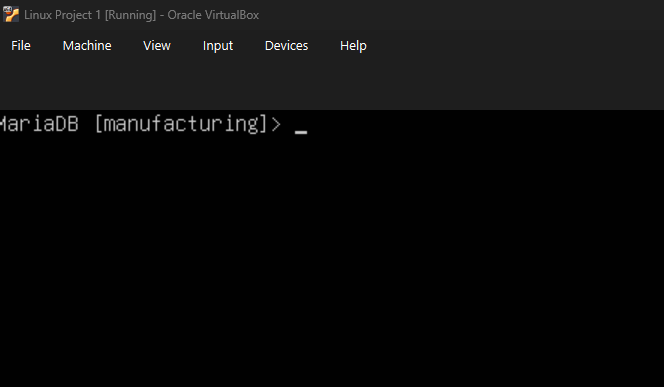

Following the format of my second linux project of server being VM2/ project 2 as the admin and VM1 as the client creating a basic layout you might see at work.

The first thing i had to check was if the client was able to connect to the server, which required adjusting the bind address to make sure it goes through the peer to peer network rather than the default vm one.
this worked well and i manged to get a specific VM1 user access (C-Tec) and limit its permissions to the manufacturing database. initial thoughts MariaDB so far is its very direct and understandable theres just some ideas that can confude me at times like closing a command line with a semi colon its bizarre but its bizarre enough to were im remembering to use it.

---

##  Database rules

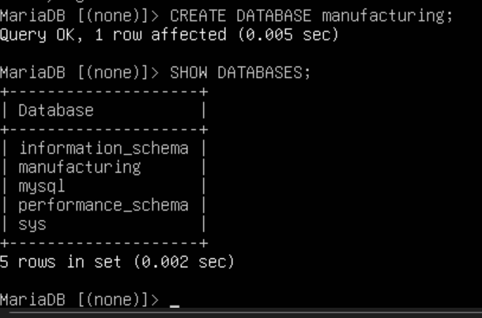
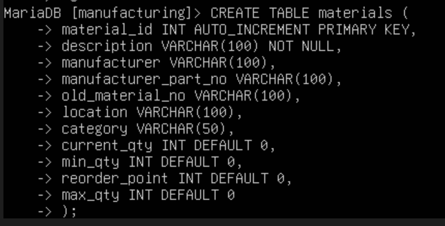
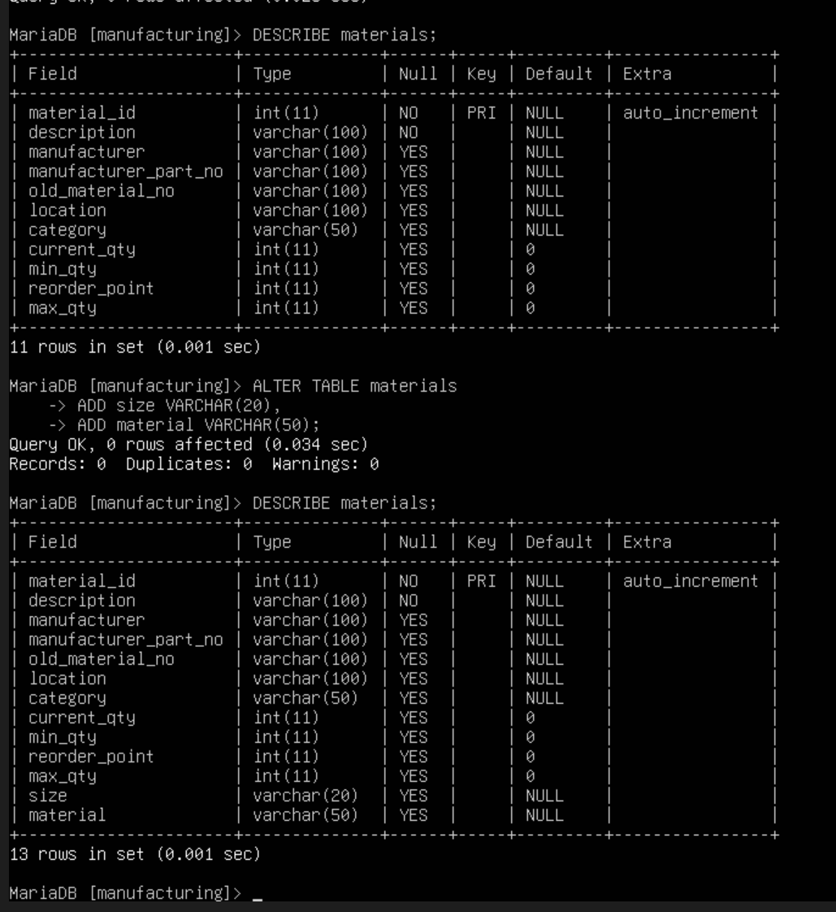

I've now got to the part were my current roles is helping build this idea/demo database through what i see and use everyday on sap. ideas like old material number, min/max and reorder point all come from work, an old material number is what Heinz used to use on there legacy system before Sap, which was made up of 3 or more letter based on the work area of the factory or a specific machine and a 3 digit number for example Can001 making that for the can area.New ideas that ive added are size and alloy/ , material for understandable reasons of time saving at work these are usually included as a part of the items description which if you don't know what exactly you're looking for but in this database were i might at most have 10-12 items it makes sense.

## Database learning

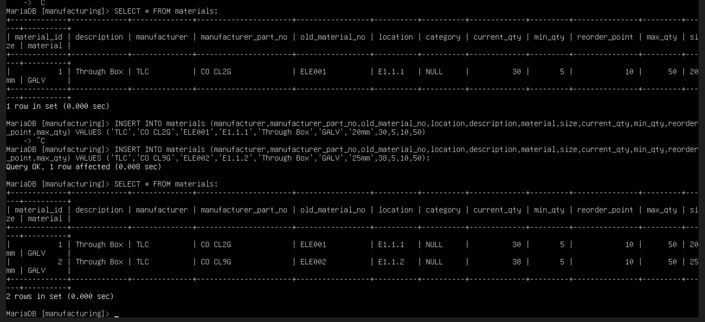
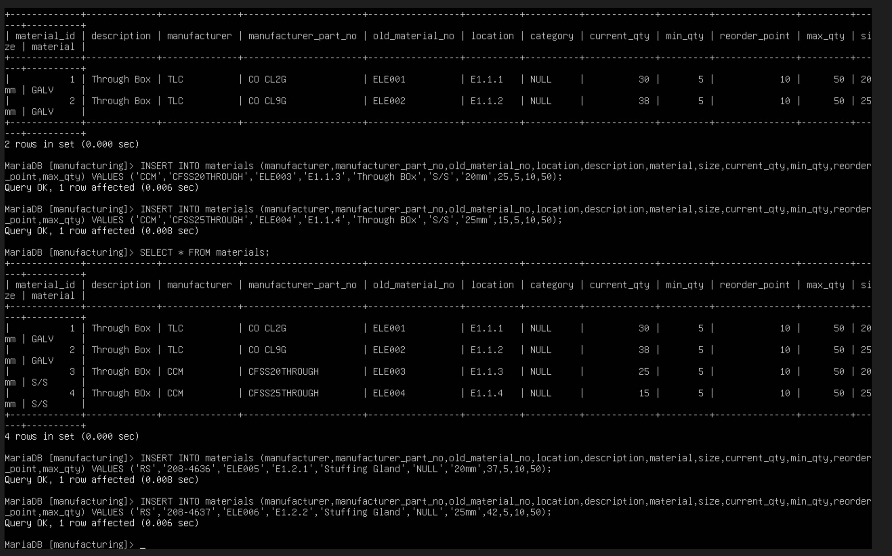
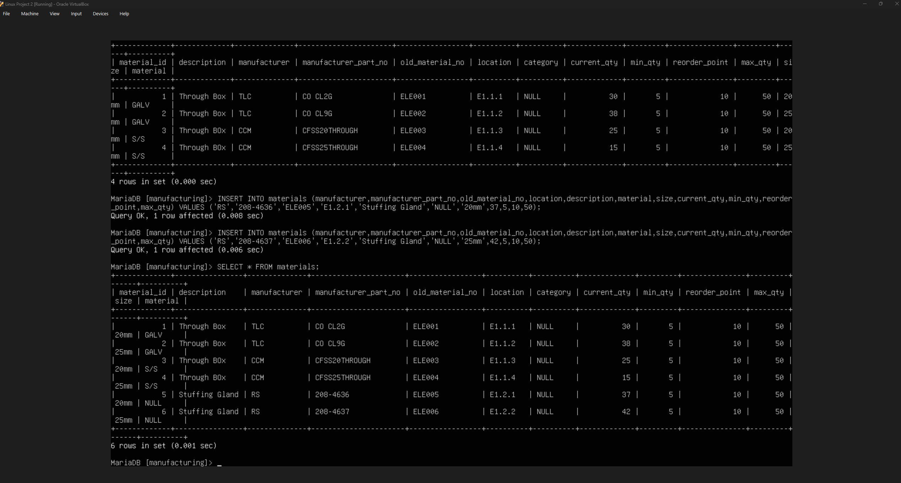

# location concept
E1= the unit/shelf where the item is 
.1.=the shelf level 
.1=the bin on the shelf 
(each shelf in this concept holds 4 items/bins)

Adding the items, it got a bit temperamental having to re-write lines because id not punctuated it correctly etc but once i got the general layout it started becoming easier. For now ive just stuck to electrical fittings because the simple and can be made specific when it comes to searching because you have both size and metal to go by which can make the searching more nuanced, overall again its just understanding the concepts and the conversions from both Linux and SAP and understanding how i do them here .

----

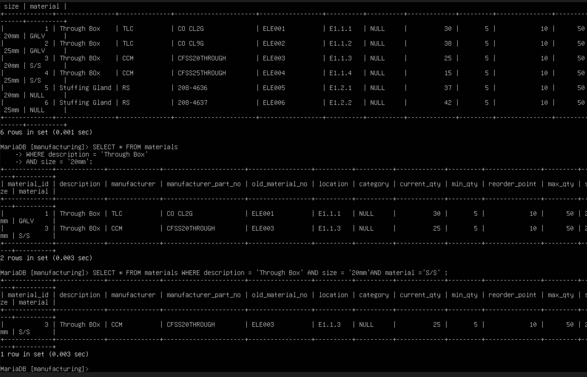
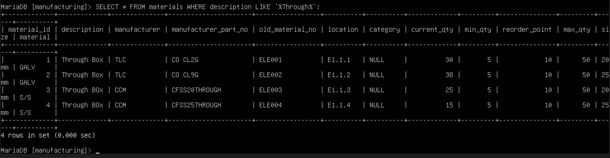
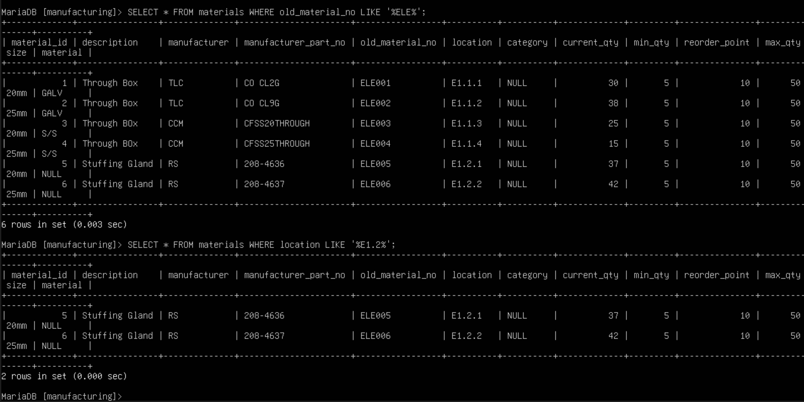

So far this is the part that has easily come the most natural to so much so i immediately tried to what id do at work which would be searching the old material number first as a vague search, which in the context didn't provide much as they all currently go off the same sequence of 'ELE' which is something to add variety to in the next 4-6 i add but i reframed by location instead using 'E1.2' and gave me a better idea. Again this part felt most natural to what i already do the the vague LIKE searches and in a lot of  ways better because you can layer your search with AND and then manufacturer which if i was in sap and someone asked me "who supplies this part?" i would have to find the part go int MMBE then go into display material then go into a specific layer that to  get my answer or going into a recent PO etc rather than adding AND.
